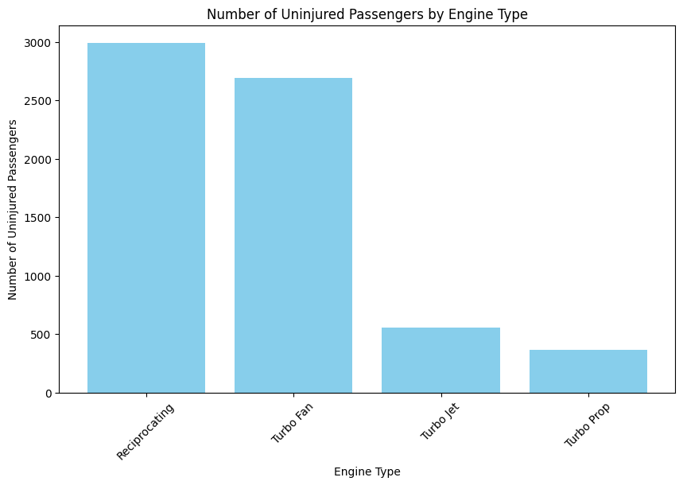
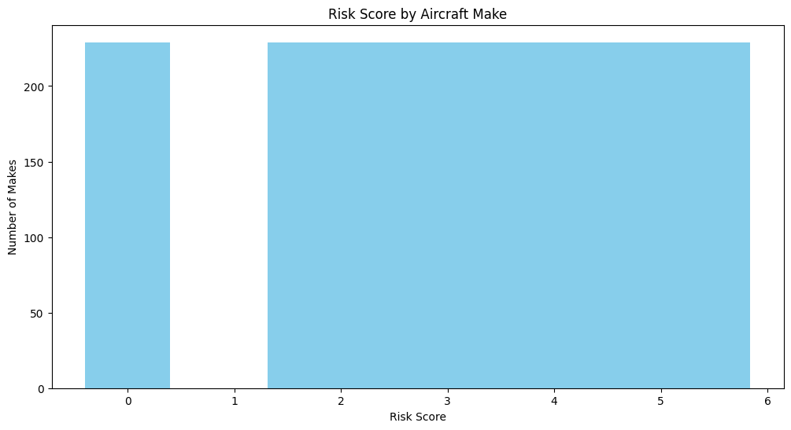
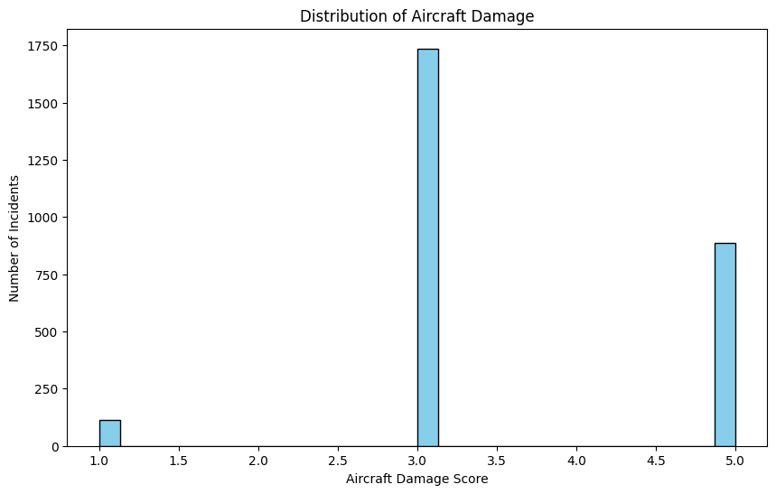
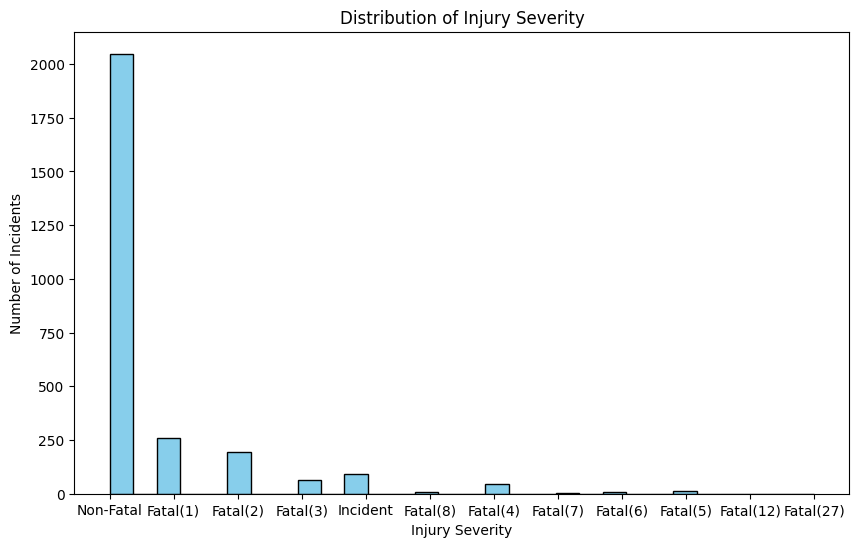
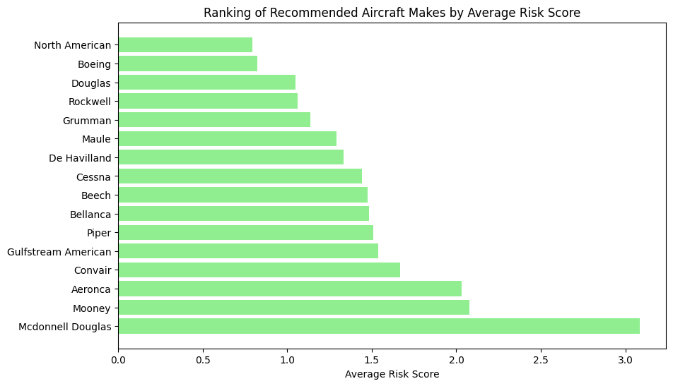

# DS-Phase1-Project
# Overview
Lowest-Risk Aircraft purchase Strategy: A comprehensive data analysis project to compare and determine which aircraft have the lowest risk for an expanding business. 
Features data cleaning,analysis,visualizasion and giving recommendations.

# Business Understanding

The company wishes to expand to the Aviation Industry to diversify its portfolio. They are interested in purchasing and operating airplanes for commercial and private use. Given aviation assets involve srict safety regulations and significant operational risks, the core business objective is to minnimize these risks by identifying aircraft categories with the lowest historical risk.

## Stakeholders

* Head of the new Aviation Division - Expects to use the analysis and findings of this project to decide on which aircraft to purchase.

## Key Business Questions

* What Engine types (eg, Reciprocating, Turbo Fan) present the lowest overall passenger injury risk for commercial and private use?

* Which aircraft makes historically have the lowest  overall risk?

* Which aircraft makes present the lowest aircract damage and injury severity after an incident?

# Data Understanding and Analysis

## Source of Data

This data was obtained from a [github repository](https://github.com/learn-co-curriculum/dsc-phase-1-project-v3/blob/1c3ea4c2ac868f4467e6f55304b5713d40314c35/data/Aviation_Data.csv) and includes aviation accident data from 1962 to 2023 about civil aviation accidents and selected incidents in the United States and international waters.

## Description of Data
 ### Data Quality
Data contained missing values and duplicates. Rows with missing values as well as duplicate rows were dropped.
 
 ### Scope of Data
 * The data originally had 31 columns which were filered to 12 and 2 more were calculated for analysis.
 * Chosen columns were 5 numerical and 7 non-numerical including columns with categorical data. The calculated columns were numerical.
 * Data was filtered to include only airplanes as the aircraft caegory to match the stakeholder's requirements.

 ### Key Variables
 * Aircraft Category (airplane, balloon, Helicopter, e.t.c)
 * Make (Cessna, Boeing, e.t.c)
 * Engine Type (Reciprocating, Turbo prop, Turbo Fan, Turbo Jet)
 * Aircraft damge (Minor, Substantial, Destroyed)
 * Injury Severity (Fatal, Non-Fatal,)
 * Total Fatal Injuries, Total Minor Injuries, Total Serious Injuries
# Visualisations

### Number of uninjured passengers by Engine type
Comparing engine type with number of uninjured passenger after accident shows that Reciprocating and Turbo Fan engines present the lowest passenger injury risk for commercial and private use.

 Airplane makes with these engine types are recommended.

### Risk Score by Aircraft Make

The distribution of airplane makes by risk score(calculated) shows majority of the makes carry a risk score between 1.6 and 5.8 where a risk score of 10 is the riskiest and that of 0 carries the least risk.

Airplane makes that fall under a zero risk score are recommended.

### Distribution of Aircraft Damage and Injury Severity

The two figures below tells us there are few airplane makes whose damage is minor and several whose injury severity is non-fatal. An airplane make falling within these two categories carries lowest after incident risk and is recommended.

### Ranking of recommended airplane makes
A list of recommended airplane makes was formulated by filterng the airplane makes that satisfy every criteria used (zero risk-score, Minor aircraft damage,Non-fatal injury severity and uses safe engine).

The figure below ranks recommended makes from which the top 10 were selected.

# Conclusion

### Analysis Summary
The data was filtered so that aircraft type is 'airplanes'only as required by stake holders.
After data cleaning, analysis was carried out by creating four lists which determine the criteria by which recommendable makes would be filtered. The lists are:

- Safe_Engine_Makes - Contains airplane makes using Reciprocating or turbo Fan engines which present the least injuries after incident.
- Zero_Risk_Makes - Has airplane makes whose risk score is zero. Risk score is calculated out of 10 by factoring Total Fatal Injuries, Total Serious Injuries and Total Minor Injuries while giving the highest weight to Total Fatal Injuries. 0 represents makes with no injury risk, while 10 represents makes with very high injury risk.
- Minor_Damage_Makes - List shows the makes that have had Minor injuries after an accident. 
- Non_Fatal_Makes - Has airplane makes in which there were no fatal injuries after an accident.

An airplane make that qualified to be recommended had to appear in all the four lists. There were 16 different makes that qualified which were the ranked according to their average risk and ten of them carrying the least risk were picked. The output is a tuple containing the name of these makes.

### Recommendations

* Prioritize airplane makes that are top-ranked for purchase.- Stakeholder should consider the top 10 lowest-risk airplane makes during decision making as they demonstrate consistently safer outcomes across multiple variables.

* Consider Turbo Fan or Reciprocating Engines. - If a purchase has to be made outside the top 10 recommended makes, stakeholder should mandate a technical requirement for Turbo Fan and Reciprocating Engines. These engines are correlated with low injury risk after incident.

* Keep a check on near-qualifying makes. - Airplane makes that narrowly missed qualification should be monitored for improvement trends and re-evaluated.